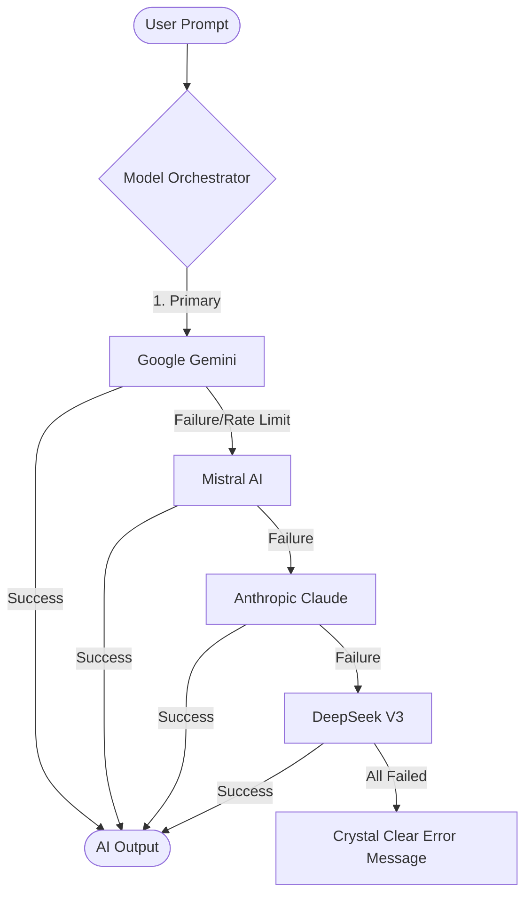

# Code Vortex (Gemini-DevOps-Copilot)

**Code Vortex** is a high-performance, multi-model DevOps AI copilot built by G R Harsha. It provides advanced intelligence for modern engineering teams, integrating leading LLMs like Google Gemini, Mistral, Anthropic Claude, and DeepSeek with a focus on robust DevOps automation and seamless code generation.

[](https://render.com/deploy?repo=https://github.com/grharsha777/Gemini-DevOps-Copilot)

🌐 **Live Demo:** [https://gemini-devops-copilot.onrender.com/](https://gemini-devops-copilot.onrender.com/)

## 🏗️ AI Request Lifecycle & Fallback Chain

Code Vortex uses a mission-critical fallback system to ensure your requests never fail. If a primary model is overloaded or fails, the orchestrator automatically cascades to the next best provider.



## 🚀 Key Features

-   **Multi-Model Intelligence:** Seamlessly integrates with **Google Gemini**, **Anthropic Claude**, **Mistral AI**, and **DeepSeek**.
-   **Smart Fallback System:** Automatically switches between AI providers if one fails, ensuring 99.9% availability for your coding tasks.
-   **Built by G R Harsha:** Dedicated to providing a premium, developer-first AI experience.
-   **Core Capabilities:**
    -   **Generate:** Create production-ready code scaffolds (package.json, tsconfig, Dockerfiles).
    -   **Explain:** Get deep technical breakdowns of complex systems.
    -   **Refactor:** Structural optimizations for performance and safety.
    -   **DevOps:** Automated pipeline generation and hotspot risk analysis.

## 🛠️ Technology Stack

-   **Backend:** Node.js, Express, TypeScript
-   **Frontend:** React, Next.js components, Tailwind CSS, Framer Motion
-   **IDE Engine:** Monaco Editor (Studio Grade)
-   **Execution:** Judge0 / Piston Multi-language runtime

## 📦 Installation & Setup

1.  **Clone the repository:**
    ```bash
    git clone https://github.com/grharsha777/Gemini-DevOps-Copilot.git
    cd Gemini-DevOps-Copilot
    ```

2.  **Install dependencies:**
    ```bash
    npm install
    ```

3.  **Configure Environment Variables:**
    Create a `.env` file in the root directory. Add your keys. Priority: **Gemini -> Mistral -> Claude -> DeepSeek**.

    ```env
    GEMINI_API_KEY=your_key
    MISTRAL_API_KEY=your_key
    ANTHROPIC_API_KEY=your_key
    DEEPSEEK_API_KEY=your_key
    ```

4.  **Start the Development Server:**
    ```bash
    npm run dev
    ```
    The application will run on `http://localhost:5000` (or similar, check terminal output).

## 📖 Usage Guide

1.  **AI Copilot Page:** Navigate to the Copilot section. Select your desired mode (Generate, Explain, Refactor, etc.), chose a model (optional, as auto-fallback handles verification), and enter your prompt.
2.  **Settings:** Configure default preferences.
3.  **Explain Code:** Paste code into the input area and select "Explain" mode to get a breakdown.

## 🤝 Contributing

Contributions are welcome! Please feel free to submit a Pull Request.

## 📄 License

This project is open-source.
